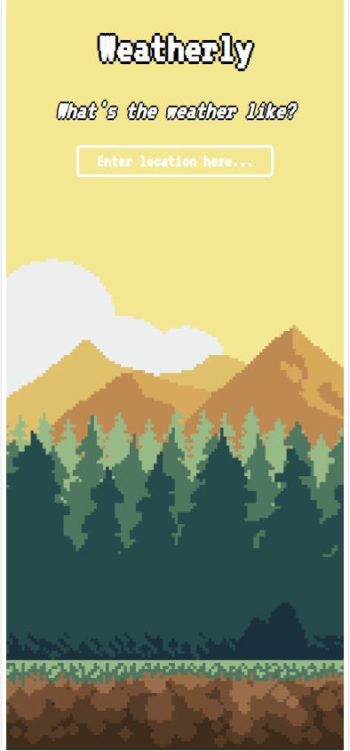
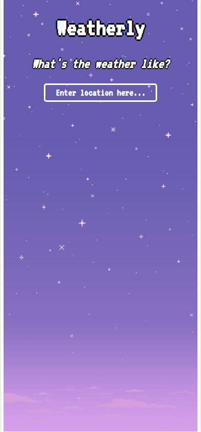
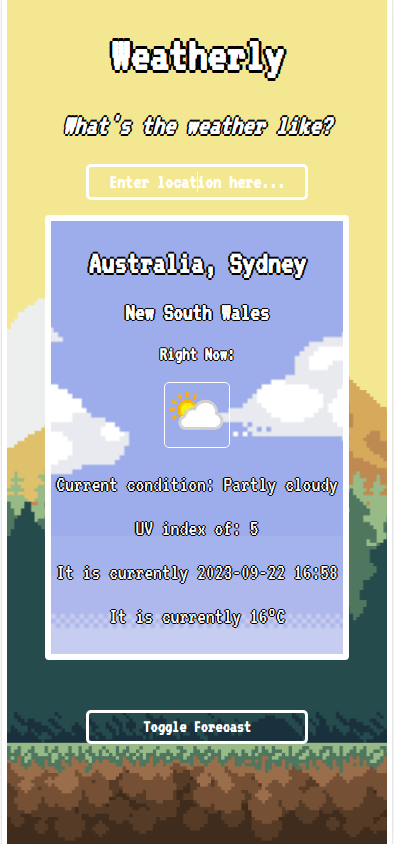
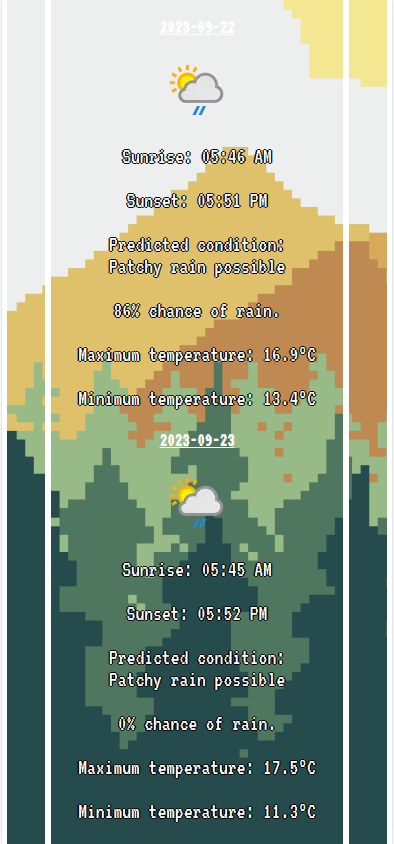

# Weatherly

## https://weatherlyreact.netlify.app/

## A website built with React, for those who frequently ask the question - "what's the weather like?"

## Requires [WeatherAPI key](https://www.weatherapi.com/) - create a .env file in the root folder with the value REACT_APP_KEY

## Features

### Animated Backgrounds
Is it day or night? From 5PM until midnight, the app background changes in order to show that it is night time - though this does not effect the conditions inside the Weather Data Div.

### Search Bar
Use the search bar to search for a location. On submit, a weather data div is returned, detailing the current weather conditions.

### Weather Data Div
- The name of the location
- An image representing the current condition
- A text description of the current condition
- The current UV index
- The current time
- The current temperature

All with an animated background which changes depending on the current weather condition.

### Forecast Data Toggle
Want to know what the upcoming weather is like?

Simply click the "toggle forecast" button to show/hide the upcoming weather over the next two days.

### Forecast Data Div
- An image representing the presented condition
- The estimated sunrise time
- The estimated sunset time
- A text description of the predicted condition
- The chance of rain on that day
- The predicted maximum temperature
- The predicted minimum temperature

